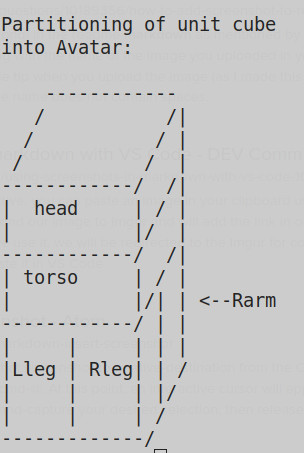

# D.I.Y. Avatars for Indie Games using MineCraft skins.

* This is a brief description of a simple, portable and open-source-friendly method to program an avatar using modern OpenGL and GLSL.

* This approach encapsulates the details of avatar shape, color, and movement within GLSL shaders and a related code object that defines vertices and texture maps.  The object may be an Ada package or C++ class.

* Runtime inputs include uniforms for time, position, and attitude.  The shaders then offload the realtime computational burdens onto the graphics processor.

* Data that defines shape and the uniforms and functions that define behavior, reside completely within the object and shaders.  This data can ultimately be as detailed and refined as your imagination permits.  And any improvements made are not obfuscated in some esoteric or proprietary format with a limited audience, but remain fully portable and easily enhanced by most any developer using mainstream programming tools.

* A huge selection of available MineCraft skins lead to the present avatar object design.

* The texture object is a unit cube that is partioned into 6 disjoint cubelets as shown above.  The 2 upper quarters map to the head and torso.  The lower half is divided into 4 identical cubelets that are mapped to arms and legs.  The Minecraft avatar skins used for the textures also have these same 6 parts that map to the rectangular limbs, head and torso.

* The avatar object code details the gridding & texture mapping coordinates.

* The vertex shader defines orientations & motions versus time.

* The result is an avatar defined by an image and some text files:
	* avatar object (avatarolay.ad?)
	* vertex shader (avatarobj.vs)
	* fragment shader (avatarobj.fs)
	* any MineCraft Skin png file (skin.png)

* Interfacing game code with such an avatar is simple.  Essentially you need only pass the updated uniform values prior to drawing. See "procedure drawAvatar" for details.

* Of course one still needs a decent camera positioning and pointing policy within the game code in order to fully appreciate and exhibit the avatar. The details are beyond the scope of this brief introduction, but generally, a good policy is a damped and delayed movement toward some fixed ideal camera position above and behind the avatar. See Wikipedia: "Virtual camera system"

# Conclusion

This method is currently being used in two 3D game projects written in Ada:

* AdaVenture
* AdaGate

Note that the avatar code was incidental to the game development, and not designed as a tutorial. This article is intended to serve as the tutorial.

You can get all details and full source code, free, at:  

* https://github.com/fastrgv?tab=repositories
* https://www.indiedb.com/members/fastrgv/games
* https://fastrgv.itch.io
* https://sourceforge.net/u/fastrgv/profile/
* https://gamejolt.com/@fastrgv/games

